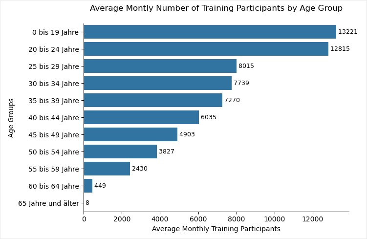

# AMS Data Bivariate EDA:   A Bivariate Exploratory Data Analysis (EDA) of Age and Gender in Training Participation for Austria's Unemployed Office (AMS)

 

---  
# Project Overview
This project investigates training participation patterns within Austria's Unemployed Office (AMS) programs. A bivariate Exploratory Data Analysis (EDA) approach is employed to examine the relationships between demographics and participation. The data for this analysis comes from the Arbeitsmarktservice Österreich AMS (https://www.ams.at/).

This EDA investigates how age and gender variables influence training participation among individuals enrolled in AMS programs. By exploring the data and visualizing patterns, this project seeks to gain insights that can improve our understanding of participant demographics and the factors driving their training decisions.

**Analysis Type**: Bivariate Exploratory Data Analysis (EDA) with hypothesis exploration

Different Python libraries like Matplotlib -Pyplot-, Plotly, and Seaborn were utilized for data visualization to explore their functionalities.

 

---
# Dataset
### Metadata
|||
|-------------|-------------|
| **Name** |Training participants by gender, age groups and requested occupation - stock (ger: Personen in Schulung nach Alter und Berufswunsch - Bestand)|
| **Description** |ger: Schulungsteilnehmer_innen nach Geschlecht, Altersgruppen, Berufswunsch (Berufs-4-Steller gemäß AMS-Berufssystematik) und Arbeitsmarktbezirken (regionale Geschäftsstellen des AMS) - Monatsendbestände|
| **Publisher** | Arbeitsmarktservice Österreich AMS |
| **Schema Language** | german |
| **Schema Characterset** | utf8 |
| **Separator** | semicolon (;) |
| **Format** | Long |
| **Beginning Date/Time** | January 1, 2019, 1:00 AM (UTC+01:00) |
| **End Date/Time** | April 30, 2024, 2:00 AM (UTC+02:00) |
| **Update Frequency** | monatlich |
| **Metadata Modified** | May 3, 2024, 10:58 AM (UTC+02:00) |
| **License** | Creative Commons Namensnennung 4.0 International (CC BY 4.0) |
| **Datenquelle** | Arbeitsmarktservice Österreich (AMS), https://www.data.gv.at/auftritte/ams |
| **URL** | https://www.data.gv.at/katalog/de/dataset/personen-in-schulung-nach-alter-und-berufswunsch-bestand |   
---   
### Columns
| German | English |
|-------------|-------------|
| Monat (Datum) | Month (date) |
| Code des Arbeitsmarktbezirks (RGSCode) | Code of the labor market district (RGS code) |
| Name des Arbeitsmarktbezirks (RGSName) | Name of the labor market district (RGS name) |
| Geschlecht (Geschlecht) | Gender (gender) |
| Altersgruppen (Altersgruppe) | Age groups (age group) |
| Berufs-4-Steller gemäß AMS-Berufssystematik - Code (Berufs4Steller) | Occupation 4-digit code according to the AMS occupational classification system (Occupation 4-digit code) |
| Berufs-4-Steller gemäß AMS-Berufssystematik - Bezeichnung (Berufs4StellerBez) | Occupation 4-digit code according to the AMS occupational classification system - name (Occupation 4-digit code) |
| Bestand zum Stichtag/Monatsendbestand (Bestand) | Stock on the reference-date/end-of-month (Stock) |   
--- 
### Column/Variable Categorization
| **Col. Name** | Main type | Subtype |
|-------------|---------|-------|
| **Datum** | Categorical | Nominal |
| **RGSCode** | Categorical | Nominal |
| **RGSName** | Categorical | Nominal |
| **Geschlecht** | Categorical | Nominal |
| **Altersgruppe** | Categorical | Ordinal |
| **Berufs4Steller** | Categorical | Nominal |
| **Berufs4StellerBez** | Categorical | Nominal |
| **BESTAND** | Numerical | Discrete |

 

---  
# Methodology
The project employs a bivariate EDA approach to examine the relationship between age group (25-40 years) and gender in relation to training participation. The analysis involves:
## 1. Data Acquisition and Cleaning:
   * Downloading the AMS training data.
   * Missing values are handled by dropping rows with incomplete data.
   * Unnecessary columns are removed.

## 2. Initial Data Exploration:
   The initial exploration focuses on age groups, revealing trends in training participation across various age brackets. Techniques used include:
   * Descriptive Statistics: Summarizing data with measures like average monthly participants and distributions.
   * Visualization: Employing bar charts, trend lines, and boxplots to visually represent patterns.

## 3. Investigating the Exploratory Hypothesis:
   * Focusing on the 25-40 age group, analyzing average monthly training participation for both genders across years.
   * Employing tables and visualizations to explore potential gender-based differences.

 

---
# Results
## 1. Data Acquisition and Cleaning:
* Nr. columns: 9
* Nr. rows: 1.806.070
* Nr. colums dropped: 1
* Nr. rows dropped: 517
* Nr. duplicates: 0

## 2. Initial Data Exploration:
* Greater variability in participation for age groups 20-50 during pandemic years.
* A significant decline in training participation across all age groups following the COVID-19 pandemic (February 2020).
<kbd>
  
</kbd>  

    

* Potential outliers in the 60+ age groups for average monthly participation.      
<kbd>
  
</kbd>  

## 3. Investigating the Exploratory Hypothesis
The project investigates the following exploratory hypothesis:

**The training attendance for age groups between 25 and 40 years –where individuals experience crucial life transitions– exhibits divergent trends between females and males.**  

This hypothesis is driven by the notion that life transitions (family, career) during this age range might influence training attendance differently for genders.

The analysis focuses on the 25-40 age group and utilizes methods like:

* Data Subsetting: Isolating relevant age groups and gender data.
* Comparison of Average Monthly Training Participants: Analyzing trends for females and males over time.

### 3.1 Results
The analysis reveals a compelling trend:
* The average monthly number of participants increased post-pandemic, but the participation proportion between genders remained relatively stable.
  
<kbd>
  
</kbd>   
   
   

 
   
  
* **Females** exhibit an **increasing** trend in training attendance with age within the 25-40 range.
* Conversely, **males** demonstrate a **decreasing** trend in training attendance as they age within this range (This observed pattern has remained consistent since 2020, suggesting a sustained trend)

<kbd>
  
</kbd> 

### 3.2 Discussion
Interpreting these results reveals a significant gender-based divergence in training attendance patterns for the critical 25 to 40-year life stage. Acknowledging limitations impacting generalizability, such as uncertainty about individuals starting a family at ages 25-30, is essential.

This gender-based divergence, with females trending upward and males downward, suggests the need for tailored strategies in employment support programs. Gender-sensitive interventions, recognizing specific learning patterns, should be conducted by AMS.

Further exploration is vital to identify and address potential confounding variables influencing observed trends. Subsequent analyses may involve incorporating additional datasets or collecting new data to enhance understanding of dynamics propelling training attendance disparities between genders in this age group. These datasets could include information about Employment History, Educational Background, Marital Status, and Family Planning.

 

---
# Getting Started:

This project utilizes 
* Python 3.11+ (Anaconda)
* Jupyter Notebooks

#### Libraries:
* pandas
* numpy
* matplotlib -pyplot-
* seaborn
* plotly
* requests
* os
* json

#### Instructions:

1. Clone the repository.
2. Install required dependencies.
3. Open the Jupyter Notebook [ams_data_bivariate_eda.ipynb](https://github.com/cperead/ams_data_bivariate_eda/blob/main/ams_data_bivariate_eda.ipynb) file and run the code cells sequentially.
